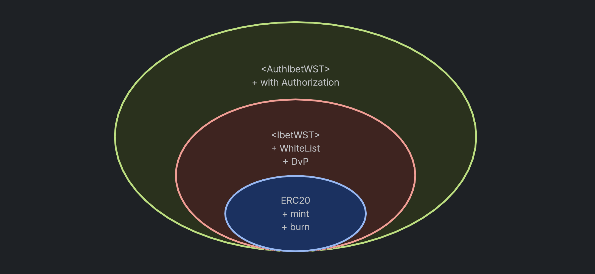
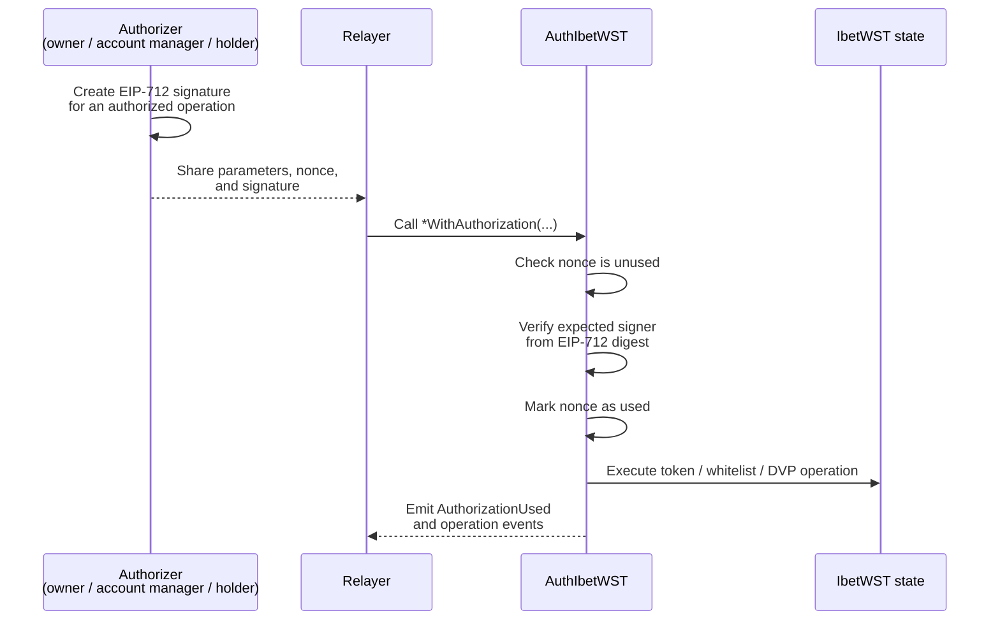
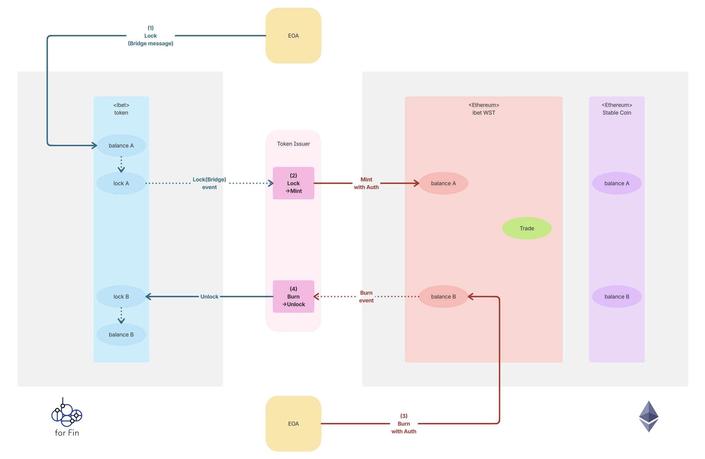
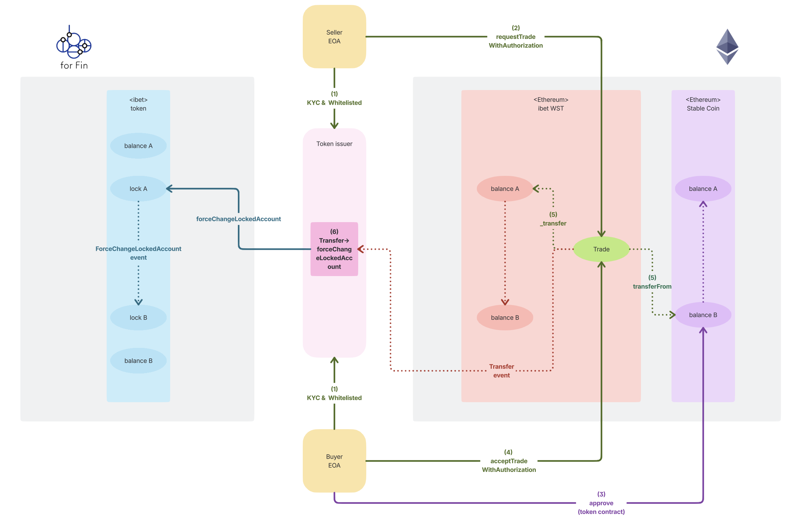

# ibet-WST 🌏

<p>
  
  
</p>

English | [日本語](README_ja.md)

## Overview

ibet-WST (ibet Worldwide Settlement Token) is a protocol that bridges security tokens on the ibet for Fin consortium blockchain with EVM networks, including Ethereum, enabling global DvP (Delivery versus Payment) settlement on public blockchains.

- [IbetWST](contracts/token/IbetWST.sol): The main contract for ibet-WST. It is implemented as an extension of the ERC20 token standard, providing whitelist management for holders and DvP settlement functionality.
- [AuthIbetWST](contracts/token/AuthIbetWST.sol): An extension of the IbetWST contract that adds EIP-712 signature-based authorization. Authorized operations can be submitted by any relayer while the contract verifies the expected signer, consumes a nonce to prevent replay, and emits `AuthorizationUsed`. This supports gasless execution for token operations.



Gasless execution with EIP-712 signatures allows token holders to authorize operations without needing to hold Ether for gas. Instead, they can sign messages off-chain, and relayers can submit these signed messages to the blockchain on their behalf. The `AuthIbetWST` contract verifies the signatures and executes the authorized operations while ensuring security through nonce management and signer verification.



## Workflows

### Whitelist Management

WST transfers and DVP trade requests require the target ST accounts to be registered in the whitelist. The owner, or an account manager enabled by `setAccountManager`, registers each participant with `addAccountWhiteList(STAccountAddress, SCAccountAddressIn, SCAccountAddressOut)`.

In addition to the ST account, the whitelist also registers the SC accounts used for DVP. The seller receives SC at `SCAccountAddressIn`, and the buyer pays SC from `SCAccountAddressOut`.

### Mint & Burn



The ibet-WST token is issued and burned by updating the ERC-20 balance on the EVM network. These balance changes are controlled by the token owner so that WST circulation on the EVM network stays linked to the lock state of the underlying security tokens on ibet.

- Mint: after the corresponding security tokens are locked on ibet, the token owner calls `mint(to, value)` to issue WST to the target ST account.
- Burn: a holder calls `burn(value)` to burn WST from their own balance. After WST is burned, the token owner releases the corresponding ibet-side lock.
- Transfer: WST transfers are also part of the lock-linked lifecycle. Both `transfer(to, value)` and `transferFrom(from, to, value)` are allowed only when the sender and recipient ST accounts are registered in the whitelist, so WST cannot be moved to or from accounts outside whitelist management.

### DVP



The DVP workflow exchanges WST (security token side) and an ERC-20 stable coin (cash side) through a trade request managed by `IbetWST`.

- Trade request: the seller calls `requestTrade(buyerSTAccountAddress, SCTokenAddress, STValue, SCValue, memo)`. The contract creates a `Trade` in `Pending` state, increments the trade index, stores the seller and buyer ST accounts, and resolves the cash accounts from the whitelist.
- Buyer preparation: before accepting the trade, the buyer's SC account must hold enough stable coin and must approve the WST contract to transfer `SCValue` from `buyerSCAccountAddress`.
- Accept: the buyer calls `acceptTrade(index)`. The trade state becomes `Executed`, WST is transferred from the seller ST account to the buyer ST account as the EVM-side representation of the locked security token position, and the stable coin is transferred from the buyer SC account to the seller SC account with `safeTransferFrom`.
- Cancel or reject: while the trade is `Pending`, the seller can cancel it with `cancelTrade(index)`, and the buyer can reject it with `rejectTrade(index)`. These paths update the state to `Cancelled` or `Rejected` without transferring WST or SC.

## Install & Setup

### Prerequisites

Development requires `anvil`, the local Ethereum node included in Foundry.

Install Foundry by following the [official installation guide](https://getfoundry.sh/introduction/installation/):

```
$ curl -L https://foundry.paradigm.xyz | bash
$ foundryup
```

After installation, confirm that `anvil` is available:

```
$ anvil --version
```

Install 3rd-party package modules:
```
$ make install
```

Setup the development environment:
```
$ make setup
```

This installs Ape plugins and Solidity dependencies for local Foundry-based development.

## Developing Smart Contracts


### Compile Contracts

You can compile the smart contracts by running the following command:
```
$ make compile
```

### Running the tests

You can run the tests with:
```
$ make test
```

Or you can run the particular test file with:
```
$ make test {path_to_test_file}
```
