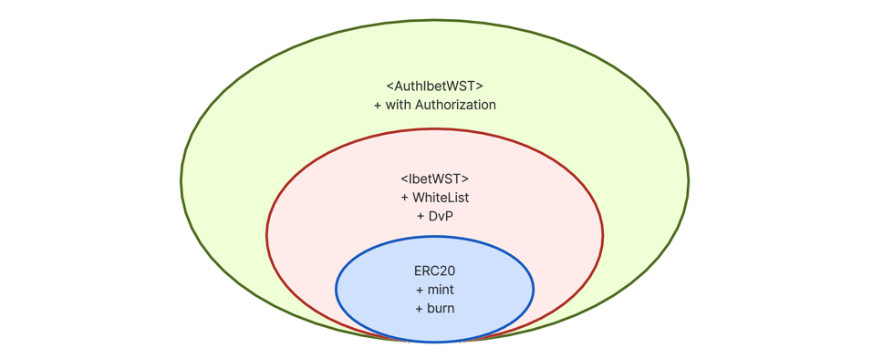

# ibet-WST 🌏

## Overview

ibet-WST (ibet Worldwide Settlement Token) is a protocol that bridges security tokens on the ibet for Fin consortium blockchain with EVM networks, including Ethereum, enabling global DvP (Delivery versus Payment) settlement on public blockchains.

- [IbetWST](contracts/token/IbetWST.sol): The main contract for ibet-WST. It is implemented as an extension of the ERC20 token standard, providing whitelist management for holders and DvP settlement functionality.
- [AuthIbetWST](contracts/token/AuthIbetWST.sol): An extension of the IbetWST contract that adds authentication using EIP-712 signatures. This enables gasless transactions for various ibet-WST functions.



## Install & Setup

Install 3rd-party package modules:
```
$ make install
```

Setup the development environment:
```
$ make setup
```

## Developing Smart Contracts


### Compile Contracts

You can compile the smart contracts by running the following command:
```
$ make compile
```

### Running the tests

You can run the tests with:
```
$ make test
```

Alternatively, you can use pytest and run it as follows.
```
$ pytest tests/
```
