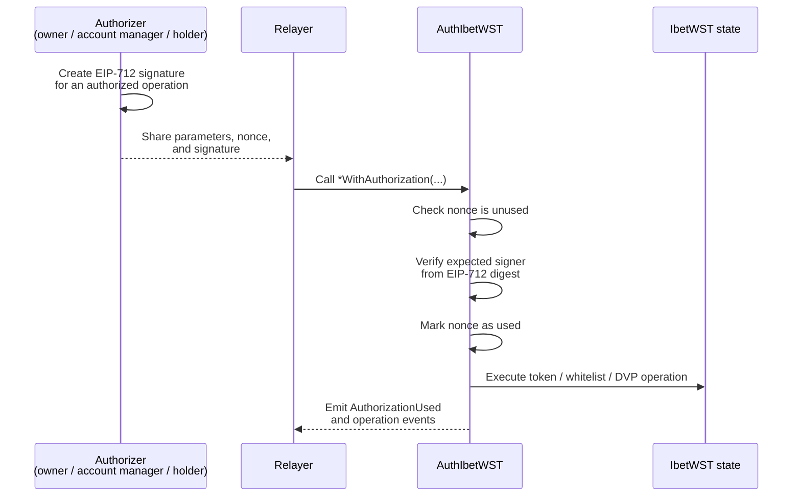

# ibet-WST 🌏

<p>
  
  
</p>

[English](README.md) | 日本語

## 概要

ibet-WST (ibet Worldwide Settlement Token) は、ibet for Fin コンソーシアムブロックチェーン上のセキュリティトークンと、Ethereum を含む EVM ネットワークを接続するプロトコルです。これにより、パブリックブロックチェーン上でグローバルな DvP (Delivery versus Payment) 決済を実現します。

- [IbetWST](contracts/token/IbetWST.sol): ibet-WST のメインコントラクトです。ERC20 トークン標準の拡張として実装されており、保有者のホワイトリスト管理と DvP 決済機能を提供します。
- [AuthIbetWST](contracts/token/AuthIbetWST.sol): IbetWST コントラクトの拡張で、EIP-712 署名に基づく認可機能を追加します。認可された操作は任意のリレイヤーが送信でき、コントラクトは期待される署名者を検証し、リプレイ防止のために nonce を消費し、`AuthorizationUsed` を発行します。これにより、トークン操作のガスレス実行をサポートします。


EIP-712 署名によるガスレス実行では、トークン保有者がガス代のための Ether を保有していなくても操作を認可できます。保有者はオフチェーンでメッセージに署名し、リレイヤーがその署名済みメッセージを保有者の代わりにブロックチェーンへ送信できます。`AuthIbetWST` コントラクトは署名を検証し、nonce 管理と署名者検証によって安全性を確保しながら、認可された操作を実行します。



## ワークフロー

### ホワイトリスト管理

WST の転送と DVP の取引リクエストでは、対象となる ST アカウントがホワイトリストに登録されている必要があります。オーナー、または `setAccountManager` によって有効化されたアカウントマネージャーが、`addAccountWhiteList(STAccountAddress, SCAccountAddressIn, SCAccountAddressOut)` で各参加者を登録します。

ホワイトリストには、ST アカウントに加えて、DVP で利用する SC アカウントも登録します。売り手は `SCAccountAddressIn` で SC を受け取り、買い手は `SCAccountAddressOut` から SC を支払います。

### Mint & Burn


ibet-WST トークンは、EVM ネットワーク上の ERC-20 残高を更新することで発行および焼却されます。これらの残高変更はトークンオーナーによって制御され、EVM ネットワーク上の WST 流通量が、ibet 上の裏付けとなるセキュリティトークンのロック状態と連動するようにします。

- Mint: 対応するセキュリティトークンが ibet 上でロックされた後、トークンオーナーが `mint(to, value)` を呼び出し、対象の ST アカウントに WST を発行します。
- Burn: 保有者は `burn(value)` を呼び出して自身の残高から WST を焼却します。WST の焼却後、トークンオーナーは対応する ibet 側のロックを解除します。
- Transfer: WST の転送も、ロックと連動したライフサイクルの一部です。`transfer(to, value)` と `transferFrom(from, to, value)` は、送信者と受信者の ST アカウントがどちらもホワイトリストに登録されている場合にのみ許可されます。これにより、WST がホワイトリスト管理外のアカウントへ、または管理外のアカウントから移動することを防ぎます。

### DVP


DVP ワークフローでは、`IbetWST` が管理する取引リクエストを通じて、WST（セキュリティトークン側）と ERC-20 ステーブルコイン（資金側）を交換します。

- 取引リクエスト: 売り手が `requestTrade(buyerSTAccountAddress, SCTokenAddress, STValue, SCValue, memo)` を呼び出します。コントラクトは `Pending` 状態の `Trade` を作成し、取引インデックスをインクリメントし、売り手と買い手の ST アカウントを保存します。また、ホワイトリストから資金アカウントを解決します。
- 買い手の準備: 取引を承諾する前に、買い手の SC アカウントは十分なステーブルコインを保有し、WST コントラクトが `buyerSCAccountAddress` から `SCValue` を転送できるように approve しておく必要があります。
- 承諾: 買い手が `acceptTrade(index)` を呼び出します。取引状態は `Executed` になり、ロックされたセキュリティトークンポジションの EVM 側表現として、WST が売り手 ST アカウントから買い手 ST アカウントへ転送されます。また、ステーブルコインは `safeTransferFrom` によって買い手 SC アカウントから売り手 SC アカウントへ転送されます。
- キャンセルまたは拒否: 取引が `Pending` の間、売り手は `cancelTrade(index)` でキャンセルでき、買い手は `rejectTrade(index)` で拒否できます。これらの経路では、WST や SC は転送されず、状態のみが `Cancelled` または `Rejected` に更新されます。

## インストールとセットアップ

### 前提条件

開発には、Foundry に含まれるローカル Ethereum ノードである `anvil` が必要です。

[公式のインストールガイド](https://getfoundry.sh/introduction/installation/) に従って Foundry をインストールしてください。

```
$ curl -L https://foundry.paradigm.xyz | bash
$ foundryup
```

インストール後、`anvil` が利用できることを確認します。

```
$ anvil --version
```

サードパーティのパッケージモジュールをインストールします。

```
$ make install
```

開発環境をセットアップします。

```
$ make setup
```

これにより、ローカルの Foundry ベース開発に必要な Ape プラグインと Solidity 依存関係がインストールされます。

## スマートコントラクト開発

### コントラクトのコンパイル

以下のコマンドでスマートコントラクトをコンパイルできます。

```
$ make compile
```

### テストの実行

以下のコマンドでテストを実行できます。

```
$ make test
```

特定のテストファイルを実行することもできます。

```
$ make test {path_to_test_file}
```
